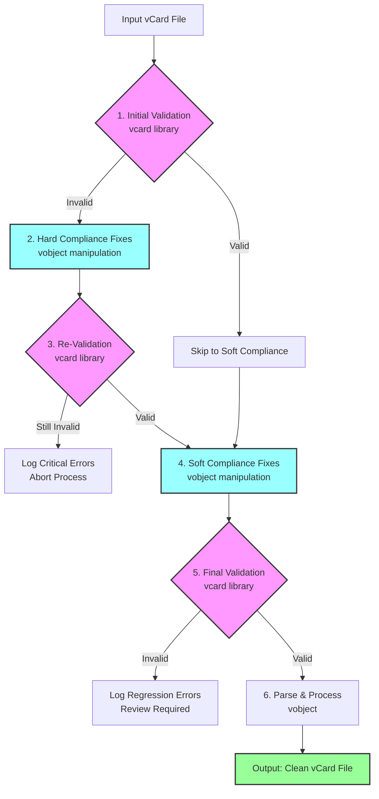

# ContactPlus Workflow Diagram

## Complete vCard Processing Pipeline



## Validation Points (Pink)

1. **Initial Validation**: Identifies RFC violations
2. **Re-Validation**: Confirms hard fixes worked
3. **Final Validation**: Ensures soft fixes didn't break compliance

## Processing Points (Blue)

1. **Hard Fixes**: Add missing FN, VERSION, N fields
2. **Soft Fixes**: Extract contacts, fix capitalization, format phones

## Data Flow Examples

### Success Path
```
Bad vCard → Validate (96 errors) → Fix → Validate (0 errors) → 
Enhance → Validate (0 errors) → Success ✅
```

### Soft Fix Regression Path
```
Fixed vCard → Soft Fix → Validate (2 errors) → 
Log Issue → Manual Review Required ⚠️
```

## Key Safety Features

1. **Multiple Checkpoints**: Validation at 3 critical stages
2. **Fail-Safe**: Aborts if critical fixes fail
3. **Regression Detection**: Catches soft fixes that break compliance
4. **Audit Trail**: Complete logging at each stage

## File Outputs at Each Stage

```
contacts.vcf                    # Original input
    ↓
contacts_FIXED.vcf             # After hard compliance fixes
    ↓
contacts_FIXED_SOFT.vcf        # After soft compliance fixes
    ↓
contacts_PROCESSED.vcf         # Final validated output
```

## Validation Report Structure

```json
{
  "stage_1_initial": {
    "errors": 96,
    "sample": ["Missing FN", "Missing VERSION"]
  },
  "stage_3_post_hard": {
    "errors": 0,
    "status": "RFC compliant"
  },
  "stage_5_final": {
    "errors": 0,
    "status": "Fully compliant and enhanced"
  }
}
```

## Implementation in Code

```python
# The complete workflow in vcard_workflow.py
workflow = VCardWorkflow(
    auto_fix=True,         # Apply hard fixes
    backup=True,           # Create backups
    soft_compliance=True   # Apply soft fixes
)
result = workflow.process_file("contacts.vcf")

# Check validation at each stage
print(f"Initial errors: {result['initial_validation']['error_count']}")
print(f"After hard fix: {result['post_fix_validation']['error_count']}")
print(f"After soft fix: {result['post_soft_validation']['error_count']}")
```